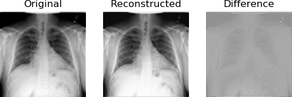
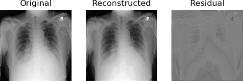

## CoroNet: A Deep Network Architecture for Semi-Supervised Task-Based Identification of COVID-19 from Chest X-ray Images

**Disclaimer: The proposed CoroNet framework is at an initial research state and is meant for academic purposes for reproducibility and contributing to the ongoing COVID-19 research. The proposed network should not be used for self-diagnosis purposes. Stay HOME and Stay SAFE and during any problem consult the local authorities for help.**

This repository contains source code necessary to reproduce some of the main results in [the paper]():

**If you use this software, please consider citing:**
    
    @misc{khobahi2020coronet,
    title={CoroNet: A Deep Network Architecture for Semi-Supervised Task-Based Identification of COVID-19 from Chest X-ray Images},
    author={Shahin Khobahi, Chirag Agarwal and Mojtaba Soltanalian},
    year={2020},
    eprint={},
    archivePrefix={medrXiv},
    primaryClass={cs.LG}
    
## 1. Setup

### Installing software
This repository is built using PyTorch. You can install the necessary libraries by pip installing the requirements text file `pip install -r ./requirements.txt`

**Note:** We ran our codes using PyTorch=1.0.0 with CUDA 9.0.

## 2. Dataset
We used the dataset provided by [COVID-Net](https://github.com/lindawangg/COVID-Net/). All the steps of data preparation and generation steps are followed as described in their [README](https://github.com/lindawangg/COVID-Net/blob/master/README.md). The dataset was created by combining different open source chest radiography datasets such as:
* https://github.com/ieee8023/covid-chestxray-dataset
* https://github.com/agchung/Figure1-COVID-chestxray-dataset
* https://www.kaggle.com/c/rsna-pneumonia-detection-challenge (which came from: https://nihcc.app.box.com/v/ChestXray-NIHCC)

**Note:** The generated training and testing numpy files should be kept in the [./data](./data) folder.

Our dataset distribution:

| Data Split 	| Healthy 	| non-COVID Pneumonia 	| COVID-19 	|
|:----------:	|:-------:	|:-------------------:	|:--------:	|
|  Training  	|   7966  	|         8521        	|    89    	|
|   Testing  	|   885   	|         1058        	|    10    	|

## 3. Usage

### Network Architecture
Proposed CoroNet framework

    

The training and testing scripts for the Feature Pyramid AutoEncoder (FPAE) and the Covid-19 Identification Network (CIN) are in [train_FPAE.py](train_FPAE.py), and [train_CIN.py](train_CIN.py). The shell script for training the FPAE models are given and can be ran as follow.

### Examples

[train_FPAE.sh](train_FPAE.sh): 
Training individual FPAE models for Healthy and non-COVID Pneumonia images
* Running `source train_FPAE.sh` produces this result:
 
Sample Original, Reconstructed and Residual Image from a Healthy FPAE

    

Sample Original, Reconstructed and Residual Image from a non-COVID Pneumonia FPAE

    

Running [train_CIN.py](train_CIN.py) in the pretrained mode generates the following results:

##### Total number of combined parameters with FPAE and CIN: 11285369
##### Sensitivity of each class:
| Healthy 	| Pneumonia 	| COVID-19 	|
| :-------:	|:---------:	|:--------:	|
|   0.9548   	|     0.9187    	|     0.9000    	|

##### PPV of each class:
| Healthy 	| Pneumonia 	| COVID-19 	|
| :-------:	|:---------:	|:--------:	|
|   0.9067   	|     0.9614    	|     0.9000    	|

##### Dataset Evaluation Metrics
| AUC 	| Accuracy 	| Precision 	| Recall 	| F1-score 	|
|:-------:	|:---------:	|:--------:	|:--------:	|:--------:	|
|   0.9344   	|     0.9350    	|     0.9363    	|     0.9350    	|     0.9351    	|

##### Confusion Matrix

|           	| Healthy 	| Pneumonia 	| COVID-19 	|
|:---------:	|:-------:	|:---------:	|:--------:	|
|  Healthy  	|   845   	|     39    	|     1    	|
| Pneumonia 	|    86   	|    972    	|     0    	|
|  COVID-19 	|    1    	|     0     	|     9    	|

## 4. Licenses
Note that the code in this repository is licensed under MIT License, but, the pre-trained condition models used by the code have their own licenses. Please carefully check them before use. 

## 5. Questions?
If you have questions/suggestions, please feel free to create GitHub issues or contact:
* chiragagarwall12@gmail.com
* shahin.khobahi@gmail.com

